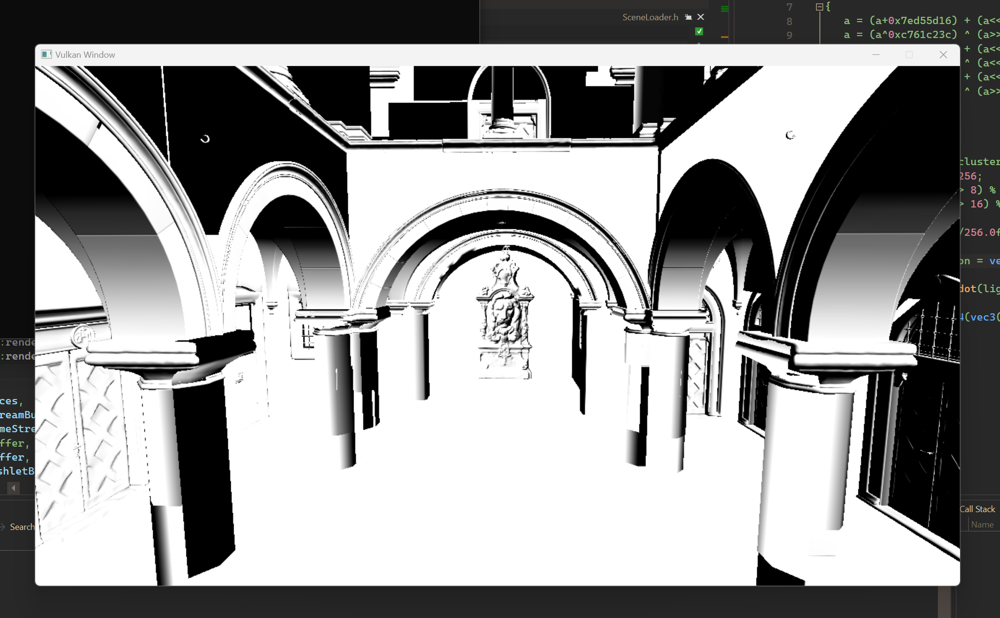

# ToyEngine

The ToyEngine is a personal project for educational purposes. Here I learn and experiment with Vulkan API, modern rendering technics, and with general programming technics.
The first milestone is to develop an abstract renderer layer and hide Vulkan complexity.

Currently, the renderer abstraction is far to be ready for use in some high-level context.

The project is developed in my spare time, and currently following features are being in development:
 - preparing the Vulkan rendering interface to be capable execute in a concurrent environment. Later on, it will be run in a job system like a multithreaded environment.
 - appropriate asset import pipeline (I will restrict it for mesh-only data at first), currently it uses some build-in dirty solution.

## Showcase
Even though it is far from being finished, I have some renderings to share:

|{ width=100% } |
|:-|
|*The first visible mesh on a screen uses vertex fetching techniques and a mesh has a clustered structure.*|

|{ width=100% } |
|:-|
|*Same as before but with a model with over 2 million vertices.*|

|{ width=100% } |
|:-|
|*Here I played a little bit with an acceleration structure building for a Raytraycing. This screenshot is taken from the NSight graphics debugging tool.*|

|{ width=100% } |
|:-|
|*New Sponza Scene. Same technics as before with different lit shader and a more complex scene.*|

## Requisitions
- Vulkan 1.3
- vcpkg
- cmake version > 3.23
- msvc compiler
